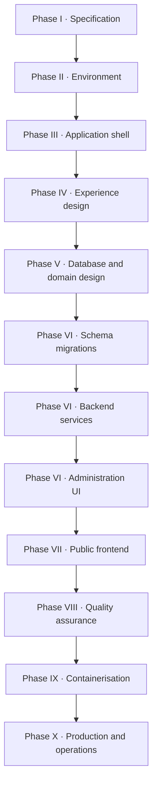

# G3 Control — Master Implementation Plan

Authoritative delivery sequence for the G3 Control digital platform.

| | |
| --- | --- |
| Product | Bilingual public website + secure operations admin |
| Method | Ten gated phases · 182 sequential steps · one active step |
| Specifications | [`docs/`](docs/README.md) |
| Governing principle | Design → document → implement → test → approve → advance |

Requirements, architecture, and locked facts live in `docs/`. This document defines **order of work only**.

---

## Delivery spine

One path from project creation to a complete, production website. Each layer starts only after the previous layer’s gate is accepted.

| Order | Layer | Phase · steps | Why this comes here |
| ---: | --- | --- | --- |
| 1 | **Project definition** | I · 1–11 | Facts, scope, rules, and architecture frozen before code |
| 2 | **Workstation and repository** | II · 12–23 | Tools and Git standards before the application exists |
| 3 | **Application shell** | III · 24–32 | Empty Laravel, locales, Filament login, Pest — no business logic |
| 4 | **UX and UI design** | IV · 33–71 | Screens approved before tables and pages are built |
| 5 | **Database design** | V · 72–76 | ERD and constraints on paper before migrations |
| 6 | **Backend design** | V · 77–85 | Use cases, state machines, and policies before PHP modules |
| 7 | **Database build** | VI · 86–97 | Migrations and seeds, one group at a time with tests |
| 8 | **Backend build** | VI · 98–107 | Domain modules and Pest; shared by admin and public UI |
| 9 | **Administration UI** | VI · 108–116 | Filament ops console before public pages read live data |
| 10 | **Public frontend** | VII · 117–129 | One URL at a time against hi-fi and live data |
| 11 | **Integration and QA** | VIII · 130–150 | Hardening, full test suite, content, local UAT |
| 12 | **Containerisation** | IX · 151–159 | Docker only after local core is stable |
| 13 | **Production** | X · 160–182 | VPS, backups, restore drill, launch, handover |

**Not parallel:** do not design the database while wireframes are open. Do not build the public site while migrations are incomplete. Do not Dockerise before Gate 150.

---

## Governance

### Step states

| State | Mark | Meaning |
| --- | --- | --- |
| Complete | `[x]` | Accepted. Do not reopen without change control. |
| Active | `← active` | The only step in progress. |
| Pending | `[ ]` | Blocked until every lower step is `[x]`. |

**Advance:** complete the active step → mark `[x]` → move `← active` to the next number.

### Gates

A **gate** is a sign-off step. The next phase remains closed until its gate is `[x]`. A gate is not satisfied by partial delivery.

### Constraints

- One active step at a time
- No skipping gates
- No parallel phases
- No “mostly done” completions
- Laravel, Docker, and production deploy each have explicit gate prerequisites (see roadmap)

---

## Status

| | |
| --- | --- |
| Active phase | **II — Environment** |
| Complete | Steps 1–18 |
| **Active step** | **19** — Initialise branches |
| Pending | Steps 20–182 · Phases II–X (remainder) |

**Hard locks:** Laravel → Phase III (step 24) · Docker → Phase IX (step 150) · VPS → Phase X (step 159)

---

## Roadmap

| Phase | Name | Steps | Opens | Gate |
| --- | --- | ---: | --- | ---: |
| I | Specification | 1–11 | Project start | 11 |
| II | Environment | 12–23 | Gate 11 | 23 |
| III | Application foundation | 24–32 | Gate 23 | 32 |
| IV | Experience design | 33–71 | Gate 32 | 71 |
| V | Data & domain design | 72–85 | Gate 71 | 85 |
| VI | Core implementation | 86–116 | Gate 85 | 116 |
| VII | Public experience | 117–129 | Gate 116 | 129 |
| VIII | Quality assurance | 130–150 | Gate 129 | 150 |
| IX | Containerisation | 151–159 | Gate 150 | 159 |
| X | Production & operations | 160–182 | Gate 159 | 177 · 182 |

---

## Phase I — Specification

**Purpose:** Freeze product definition before tooling or code.  
**Deliverables:** `docs/01`–`10`  
**Prohibited:** Git setup, Laravel, Docker

- [x] **1** · Lock baseline → [`docs/01-baseline.md`](docs/01-baseline.md)
- [x] **2** · Project charter → [`docs/02-charter.md`](docs/02-charter.md)
- [x] **3** · V1 scope → [`docs/03-scope.md`](docs/03-scope.md)
- [x] **4** · Functional requirements → [`docs/04-requirements.md`](docs/04-requirements.md)
- [x] **5** · Quality standards → [`docs/05-quality.md`](docs/05-quality.md)
- [x] **6** · Business rules → [`docs/06-rules.md`](docs/06-rules.md)
- [x] **7** · Acceptance criteria → [`docs/07-acceptance.md`](docs/07-acceptance.md)
- [x] **8** · Content inventory → [`docs/08-content.md`](docs/08-content.md)
- [x] **9** · Architecture → [`docs/09-architecture.md`](docs/09-architecture.md)
- [x] **10** · Admin scope → [`docs/10-admin.md`](docs/10-admin.md)
- [x] **11** · **Gate — documentation sign-off** · Owner accepts `docs/01`–`10` in writing · Signed off 2026-09-03

---

## Phase II — Environment

**Purpose:** Prepare the local workstation and repository standards.  
**Opens:** Gate 11 · **Gate:** 23 · **Prohibited:** Laravel

- [x] **18** · **Gate — workstation verified** · Steps 12–17 complete on this machine · Verified 2026-09-03
- [ ] **19** · ← active · Initialise branches · `main`, `develop`, `feature/*`
- [ ] **20** · Secrets policy · `.env` excluded from version control
- [ ] **21** · Configure Pint · Formatter runs on the repository
- [ ] **22** · Configure Larastan · Static analysis runs on the repository
- [ ] **23** · **Gate — repository standards** · Steps 19–22 complete

---

## Phase III — Application foundation

**Purpose:** Empty Laravel 13 shell with i18n, admin access, and test harness.  
**Opens:** Gate 23 · **Gate:** 32 · **Prohibited:** Business modules

- [ ] **24** · Create Laravel 13 application
- [ ] **25** · Verify HTTP boot
- [ ] **26** · Verify MySQL connectivity
- [ ] **27** · Verify Vite build · `npm run build` succeeds
- [ ] **28** · Install Filament 5 · `/admin` login works
- [ ] **29** · Locale routing · `/fr/`, `/en/`, `/` → `/fr/accueil`
- [ ] **30** · Time configuration · Africa/Douala display · UTC timestamps
- [ ] **31** · Verify Pest · Test suite passes on empty app
- [ ] **32** · **Gate — foundation accepted** · Steps 24–31 complete

---

## Phase IV — Experience design

**Purpose:** Approved UX before schema or public implementation.  
**Opens:** Gate 32 · **Gate:** 71 · **Prohibited:** Migrations · public page code

- [ ] **33** · Information architecture · Sitemap, navigation, page jobs
- [ ] **34** · Design system · Brand tokens, typography, Safety Line
- [ ] **35** · Media guidelines · Photography and video rules
- [ ] **36** · Component states · Default, hover, focus, error, disabled, empty
- [ ] **37** · Desktop wireframe — Accueil
- [ ] **38** · Desktop wireframe — À propos
- [ ] **39** · Desktop wireframe — Nos centres
- [ ] **40** · Desktop wireframe — École de Police
- [ ] **41** · Desktop wireframe — Nomayos
- [ ] **42** · Desktop wireframe — Services
- [ ] **43** · Desktop wireframe — Visite technique
- [ ] **44** · Desktop wireframe — Tarifs
- [ ] **45** · Desktop wireframe — Rendez-vous & Suivi
- [ ] **46** · Desktop wireframe — Sécurité routière
- [ ] **47** · Desktop wireframe — Contact
- [ ] **48** · Mobile wireframe — Accueil
- [ ] **49** · Mobile wireframe — À propos
- [ ] **50** · Mobile wireframe — Nos centres
- [ ] **51** · Mobile wireframe — École de Police
- [ ] **52** · Mobile wireframe — Nomayos
- [ ] **53** · Mobile wireframe — Services
- [ ] **54** · Mobile wireframe — Visite technique
- [ ] **55** · Mobile wireframe — Tarifs
- [ ] **56** · Mobile wireframe — Rendez-vous & Suivi
- [ ] **57** · Mobile wireframe — Sécurité routière
- [ ] **58** · Mobile wireframe — Contact
- [ ] **59** · Hi-fi design — Accueil
- [ ] **60** · Hi-fi design — À propos
- [ ] **61** · Hi-fi design — Nos centres
- [ ] **62** · Hi-fi design — École de Police
- [ ] **63** · Hi-fi design — Nomayos
- [ ] **64** · Hi-fi design — Services
- [ ] **65** · Hi-fi design — Visite technique
- [ ] **66** · Hi-fi design — Tarifs
- [ ] **67** · Hi-fi design — Rendez-vous & Suivi
- [ ] **68** · Hi-fi design — Sécurité routière
- [ ] **69** · Hi-fi design — Contact
- [ ] **70** · Admin UX · Dashboard, queues, tariff publish, FR/EN tabs
- [ ] **71** · **Gate — experience design accepted** · Steps 33–70 complete

---

## Phase V — Data & domain design

**Purpose:** Approved data model and domain logic on paper.  
**Opens:** Gate 71 · **Gates:** 76 (database) · 85 (domain)

- [ ] **72** · Conceptual data model
- [ ] **73** · Logical ERD → [`docs/11-erd.md`](docs/11-erd.md)
- [ ] **74** · Indexes, constraints, foreign keys
- [ ] **75** · Retention mapped to tables
- [ ] **76** · **Gate — database design accepted**
- [ ] **77** · Domain model · Entities, enums, codes per `docs/06`, `docs/09`
- [ ] **78** · Use-case catalogue · Request, track, tariff, schedule, contact
- [ ] **79** · Availability engine specification
- [ ] **80** · Appointment state machine specification
- [ ] **81** · Tariff engine specification
- [ ] **82** · Domain events specification
- [ ] **83** · Cache policy · Catalogues cacheable · tracking never cached
- [ ] **84** · Security design · Policies, throttling, MFA, uploads
- [ ] **85** · **Gate — domain design accepted**

---

## Phase VI — Core implementation

**Purpose:** Schema, domain services, and administration.  
**Opens:** Gate 85 · **Gates:** 97 · 107 · 116 · **Prohibited:** Public pages until Gate 116

### Schema

- [ ] **86** · Migration — company / settings + test
- [ ] **87** · Migration — centres, phones, hours + test
- [ ] **88** · Migration — schedule exceptions + test
- [ ] **89** · Migration — catalogue + test
- [ ] **90** · Migration — tariffs + test
- [ ] **91** · Migration — appointments, history + test
- [ ] **92** · Migration — internal notes · Separate from history
- [ ] **93** · Migration — content + test
- [ ] **94** · Migration — contact + test
- [ ] **95** · Migration — media, identity, audit + test
- [ ] **96** · Seed · Two centres and locked hours only · No invented prices or services
- [ ] **97** · **Gate — schema accepted**

### Domain

- [ ] **98** · Module — company settings + Pest
- [ ] **99** · Module — centres and availability + Pest
- [ ] **100** · Module — catalogue + Pest
- [ ] **101** · Module — tariffs + Pest
- [ ] **102** · Module — appointments + Pest
- [ ] **103** · Module — tracking + Pest
- [ ] **104** · Module — content + Pest
- [ ] **105** · Module — contact + Pest
- [ ] **106** · Module — notification port + Pest · No direct SMTP from UI layers
- [ ] **107** · **Gate — domain accepted** · Filament and Livewire share use cases

### Administration

- [ ] **108** · Auth · Five roles, MFA, policies · Forbidden URLs return 403
- [ ] **109** · Dashboard · Requests, contacts, live centre status
- [ ] **110** · Centre management · Hours, exceptions, alerts
- [ ] **111** · Catalogue management
- [ ] **112** · Tariff management · Draft → reviewed → published → archived
- [ ] **113** · Appointment management · Illegal transitions rejected
- [ ] **114** · Content and media · FR/EN tabs · No raw JSON editing
- [ ] **115** · Audit log
- [ ] **116** · **Gate — administration accepted**

---

## Phase VII — Public experience

**Purpose:** Ship each public URL against approved design and live data.  
**Opens:** Gate 116 · **Gate:** 129 · One page per step

- [ ] **117** · Application shell · Navigation, footer, locale switch
- [ ] **118** · Accueil
- [ ] **119** · À propos
- [ ] **120** · Nos centres
- [ ] **121** · École de Police
- [ ] **122** · Nomayos
- [ ] **123** · Services
- [ ] **124** · Visite technique
- [ ] **125** · Tarifs
- [ ] **126** · Rendez-vous & Suivi
- [ ] **127** · Sécurité routière
- [ ] **128** · Contact
- [ ] **129** · **Gate — public experience accepted**

---

## Phase VIII — Quality assurance

**Purpose:** Harden, test, populate, and validate locally before containerisation.  
**Opens:** Gate 129 · **Gate:** 150 · **Prohibited:** Docker until Gate 150

### Integration & compliance

- [ ] **130** · Data integration · No hardcoded hours, phones, or prices
- [ ] **131** · Localisation audit · FR/EN parity and glossary consistency
- [ ] **132** · SEO · Canonical, hreflang, sitemap · `/admin` disallowed in robots
- [ ] **133** · Accessibility review
- [ ] **134** · Security review · CSRF, throttling, honeypot, tracking privacy
- [ ] **135** · Performance review
- [ ] **136** · **Gate — integration accepted**

### Automated tests

- [ ] **137** · Pest — live status (`docs/07-acceptance.md`)
- [ ] **138** · Pest — tariff lifecycle
- [ ] **139** · Pest — appointment transitions
- [ ] **140** · Pest — tracking privacy
- [ ] **141** · Pest — Livewire request flow
- [ ] **142** · Pest — Filament authorisation
- [ ] **143** · **Gate — test suite accepted**

### Content & UAT

- [ ] **144** · French content load
- [ ] **145** · English content load
- [ ] **146** · Media ingestion · Real G3 assets only
- [ ] **147** · Factual audit · Baseline accuracy · No invented tariffs
- [ ] **148** · Local UAT with G3 stakeholders
- [ ] **149** · End-to-end validation · Request → confirm → track
- [ ] **150** · **Gate — local core stable**

---

## Phase IX — Containerisation

**Purpose:** Reproducible deployment environment matching local core.  
**Opens:** Gate 150 · **Gate:** 159 · **Prohibited:** VPS until Gate 159

- [ ] **151** · Container architecture → [`docs/12-docker.md`](docs/12-docker.md)
- [ ] **152** · **Gate — container design accepted**
- [ ] **153** · Application container
- [ ] **154** · MySQL container
- [ ] **155** · Redis container
- [ ] **156** · Nginx + PHP-FPM
- [ ] **157** · Queue worker and scheduler
- [ ] **158** · Parity verification · Pest suite passes in containers
- [ ] **159** · **Gate — containerisation accepted**

---

## Phase X — Production & operations

**Purpose:** Deploy, protect, launch, and hand over operations.  
**Opens:** Gate 159 · **Gate:** 177 (go-live) · **182** (program close)

### Infrastructure

- [ ] **160** · Provision VPS
- [ ] **161** · Production environment configuration
- [ ] **162** · DNS
- [ ] **163** · Reverse proxy
- [ ] **164** · TLS / HTTPS
- [ ] **165** · Deployment pipeline
- [ ] **166** · Production migration
- [ ] **167** · Production seed · Settings, centres, hours
- [ ] **168** · Smoke test

### Resilience

- [ ] **169** · On-server backups
- [ ] **170** · Off-server backup replication
- [ ] **171** · Restore drill · Verified recovery, not configuration only
- [ ] **172** · Uptime and error monitoring
- [ ] **173** · Log rotation

### Pre-launch audit

- [ ] **174** · Security audit
- [ ] **175** · Production factual audit
- [ ] **176** · Accessibility and performance audit
- [ ] **177** · **Gate — go-live approved** · Includes steps 170–171

### Launch & handover

- [ ] **178** · Public launch
- [ ] **179** · Post-launch monitoring · 72 hours
- [ ] **180** · Operational handover · Named owners and procedures
- [ ] **181** · First monthly review
- [ ] **182** · First quarterly review · Program close

---

*Step 182 completes V1 delivery. Future scope requires change control per [`docs/03-scope.md`](docs/03-scope.md).*
