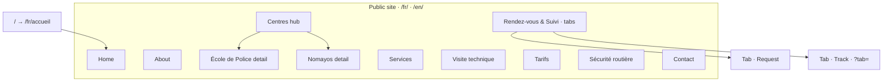

# 33 — Information architecture

| Delivery | Phase IV · step **33** |
| --- | --- |
| Specs | [03-scope](../docs/03-scope.md) · [04-requirements](../docs/04-requirements.md) · [08-content](../docs/08-content.md) |
| Routes | [config/locale.php](../config/locale.php) |
| Next | Step 34 — Design system |

Sitemap, navigation, and page jobs for V1. Routes and locale slugs are frozen in Phase I; this document defines **structure, labels, and intent** for wireframes (steps 37–58) and implementation (steps 117–129).

---

## 1. Site map

Public site only. `/admin` is excluded from navigation, sitemap, and hreflang (NFR-S-11, FR-SE-03).

### URL registry

| Internal ID | FR path | EN path | In XML sitemap | Notes |
| --- | --- | --- | --- | --- |
| `home` | `/fr/accueil` | `/en/home` | Yes | Default locale entry |
| `about` | `/fr/a-propos` | `/en/about` | Yes | |
| `centres` | `/fr/centres` | `/en/centres` | Yes | Hub — compare + live status |
| `centre_ecole_de_police` | `/fr/centres/ecole-de-police` | `/en/centres/ecole-de-police` | Yes | Child of centres |
| `centre_nomayos` | `/fr/centres/nomayos` | `/en/centres/nomayos` | Yes | Child of centres |
| `services` | `/fr/services` | `/en/services` | Yes | What G3 offers |
| `technical_inspection` | `/fr/visite-technique` | `/en/technical-inspection` | Yes | How inspection works |
| `fees` | `/fr/tarifs` | `/en/fees` | Yes | Published matrix only |
| `appointment` | `/fr/rendez-vous` | `/en/appointment` | Yes | Default tab = request |
| `appointment` · track | `/fr/rendez-vous?tab=suivi` | `/en/appointment?tab=track` | No* | Same canonical page; tab is UI state |
| `road_safety` | `/fr/securite-routiere` | `/en/road-safety` | Yes | Evergreen content |
| `contact` | `/fr/contact` | `/en/contact` | Yes | Intent-first form |
| — | `/` | `/` | No | 302 → `/fr/accueil` |
| — | `/fr/`, `/en/` | | No | 302 → locale home |
| admin | `/admin` | | **No** | robots disallow · no locale prefix |

\*Tracking tab shares the appointment URL; sitemap lists one URL per locale slug (FR-SE-03). Tab deep-links are valid entry points but not separate sitemap rows.

**Unpublished rule:** Pages or content blocked by publish flags (services, tariffs, team, media) are omitted from sitemap and public nav until live (FR-SV-04, FR-TA-04, FR-CN-08).

---

## 2. Navigation

### 2.1 Global header

| Zone | Items | Behaviour |
| --- | --- | --- |
| **Brand** | Logo → home | Same target in both locales |
| **Primary nav** | Accueil · À propos · Nos centres · Services · Visite technique · Tarifs · Sécurité routière · Contact | Seven items — centre detail pages are **not** top-level |
| **Utility CTA** | Rendez-vous & Suivi | Visually distinct (Safety orange accent); always visible on desktop |
| **Locale** | FR \| EN | Switches to the **equivalent page** in the other language (FR-LO-02); on appointment page, preserves active tab where possible |

**Nos centres:** Nav label links to the centres hub. Centre detail pages are reached from the hub (cards, map, compare) — not from a persistent mega-menu in V1. Wireframes may show optional in-page sub-nav on the hub only.

**Active state:** Highlight the nav item matching the current section. On centre detail pages, **Nos centres** stays active; breadcrumbs carry the centre name (FR-SE-04 suggestion).

### 2.2 Mobile navigation

Same information as desktop, single **menu** control:

1. Brand + menu toggle + locale toggle on one bar.
2. Expanded panel: primary nav list → utility CTA → locale (if not already in bar).
3. Rendez-vous & Suivi remains a prominent button inside or immediately below the panel — not buried.
4. No separate mobile URL set; one responsive shell (NFR-P-01, NFR-A-08).

### 2.3 Footer

**Compact** — no legal page nav in V1 ([03-scope.md](../docs/03-scope.md)).

| Block | Content |
| --- | --- |
| Identity | G3 Control · agrément line · slogan (from company settings) |
| Contact | Email · BP · optional social (when supplied) |
| Centres | Short list linking to both centre detail pages |
| Utility | Repeat high-intent links: Rendez-vous · Suivre ma demande · Tarifs · Contact |
| Locale | FR \| EN (duplicate of header is acceptable on long pages) |

Trust chips (2 centres · 7j/7 · holidays open · Agrément N°0291) may appear in footer or homepage proof zone — not a third nav tier.

### 2.4 Breadcrumbs

Use on nested pages only:

| Page | Trail (FR example) |
| --- | --- |
| Centre detail | Accueil → Nos centres → École de Police |
| All other top-level pages | Omitted or single-level (Accueil → current) per wireframe |

JSON-LD breadcrumbs are a should (FR-SE-04); structure must match visible trails.

---

## 3. Page jobs

Each page answers one primary question ([08-content.md](../docs/08-content.md)). Secondary goals and handoffs are explicit so wireframes do not smuggle new scope.

### 3.1 Summary matrix

| Page | Primary question | One-line job | Scope mnemonic |
| --- | --- | --- | --- |
| Home | Can I act, and is G3 serious? | Orient, prove trust, route to action | — |
| About | Who is G3? | Company story, agrément, team (when published) | — |
| Centres hub | Where are you, and who is open? | Compare sites, live status, pick a centre | **Where** |
| Centre detail | What about *this* site? | Hours, phones, map, gallery, book here | **Where** |
| Services | What can G3 do for my vehicle? | Catalogue linked to centres | **What** |
| Visite technique | How does inspection work? | Process, documents, video — not foreign MOT copy | **How** |
| Tarifs | What will it cost? | Published matrix, finder, handoff to request | **Cost** |
| Rendez-vous & Suivi | How do I request or follow up? | Request form + tracking on one page, two tabs | Journey |
| Sécurité routière | How do I stay safe on the road? | Evergreen tips; rain relevant to Cameroon | — |
| Contact | How do I reach G3 for my situation? | Intent → form or deep-link | Journey |

### 3.2 Home · `home`

| | |
| --- | --- |
| **Job** | Convert visitors into confident action; surface live centre status and proof. |
| **Primary actions** | Rendez-vous · Suivre ma demande · Voir tarifs · Choisir un centre · Préparer ma visite |
| **Content zones** | Hero · live strip · action grid · slogan/values · journey steps · tariff teaser · controls · centres snapshot · proof · road-safety teaser · closing CTA ([08-content](../docs/08-content.md)) |
| **Handoffs** | Actions → appointment (request tab), appointment (`?tab=suivi`), fees, centres hub, visite-technique |
| **Requirements** | FR-CE-07/08 · FR-TA-05 · FR-CN-01 · FR-CO-03 |

### 3.3 About · `about`

| | |
| --- | --- |
| **Job** | Establish legitimacy and human presence without inventing history. |
| **Primary actions** | Meet the team · See our centres · Contact |
| **Constraints** | No Nomayos opening year until Q-03 resolved |
| **Requirements** | FR-CN-01 · FR-CN-05 · FR-CO-02 |

### 3.4 Centres hub · `centres`

| | |
| --- | --- |
| **Job** | Help users choose a centre using live open/closed state and comparison. |
| **Primary actions** | View centre detail · Call · Directions · Request appointment (pre-select centre) |
| **Requirements** | FR-CE-01–09 · FR-CE-11 |

### 3.5 Centre detail · `centre_ecole_de_police` · `centre_nomayos`

| | |
| --- | --- |
| **Job** | Everything needed to visit **this** centre today. |
| **Primary actions** | Call · Itinerary · Request appointment (centre locked) · View services offered here |
| **Content** | Status now · weekly hours · phones · map · gallery · services list |
| **Requirements** | FR-CE-02–09 · FR-SV-05 |

### 3.6 Services · `services`

| | |
| --- | --- |
| **Job** | Show **what** G3 validates — per service, which centres perform it. |
| **Primary actions** | View service detail · Go to tarifs · Request appointment (service context) |
| **Constraints** | G3-validated catalogue only; unpublished hidden |
| **Requirements** | FR-SV-01–05 |

### 3.7 Visite technique · `technical_inspection`

| | |
| --- | --- |
| **Job** | Explain **how** inspection works and how to prepare. |
| **Primary actions** | Watch inspection video · See documents · Request appointment · Read tarifs |
| **Content** | Process · journey (Préparer → Accueil → Contrôle → Validation → Résultat) · FAQs · video with poster |
| **Requirements** | FR-CN-01 · FR-MD-03 · FR-CN-04 |

### 3.8 Tarifs · `fees`

| | |
| --- | --- |
| **Job** | Show **cost** from the current published matrix — never invented prices. |
| **Primary actions** | Search/filter · Print/share · Request appointment (category prefilled) |
| **Empty state** | Honest message + contact when no published version (FR-TA-09) |
| **Requirements** | FR-TA-01–09 |

### 3.9 Rendez-vous & Suivi · `appointment`

| | |
| --- | --- |
| **Job** | Submit an appointment **request** and, separately, track an existing request. |
| **Tabs** | **Request** (default) · **Track** (`?tab=suivi` / `?tab=track`) — same page, not separate routes ([03-scope](../docs/03-scope.md)) |
| **Request flow** | Centre → service → vehicle → preferred slot window → contact → review → reference |
| **Track flow** | Reference + phone **or** registration → customer-safe timeline |
| **Copy rule** | Confirmation = demande reçue / request received — not “appointment confirmed” |
| **Requirements** | FR-AP-01–12 · FR-TR-01–05 |

### 3.10 Sécurité routière · `road_safety`

| | |
| --- | --- |
| **Job** | Evergreen safety education; supports brand trust, not conversion alone. |
| **Primary actions** | Read sections · Link to visite technique |
| **Sections (min.)** | Braking · tyres · lighting · visibility · equipment · dashboard warnings · rain · pre-journey · link to inspection |
| **Requirements** | FR-CN-02 · FR-CN-03 |

### 3.11 Contact · `contact`

| | |
| --- | --- |
| **Job** | Route the user by **intent** before showing the form. |
| **Intents** | Appointment · centre · tariffs · general assistance |
| **Primary actions** | Select intent · submit form · deep-link to relevant page when faster |
| **Requirements** | FR-CT-01–05 |

---

## 4. Cross-page journeys

| Journey | Path | IA notes |
| --- | --- | --- |
| **Appointment** | Centre/services → tarifs (optional) → rendez-vous → reference → staff workflow → track tab | Centre and category prefills from upstream pages |
| **Tariff** | Home finder or tarifs → matrix row → rendez-vous with prefilled category/centre | Same resolver on home and tarifs (FR-TA-05) |
| **Centre visit** | Centres hub → detail → call/directions **or** rendez-vous | Live status consistent everywhere (FR-CE-08) |
| **Track** | Header CTA or home action → rendez-vous track tab → timeline | Generic failure on mismatch (FR-TR-03) |
| **Contact** | Any page footer/header → contact → intent-specific handling | May redirect instead of duplicating flows |

---

## 5. Language and locale

| Rule | Detail |
| --- | --- |
| Default | `/` → `/fr/accueil` |
| Switcher | Equivalent slug in the other locale; appointment tab mapped (`suivi` ↔ `track`) |
| Admin | `/admin` — no `/fr/admin` (FR-LO-03) |
| Labels | Nav strings from PHP lang files; glossary in [08-content](../docs/08-content.md) |

---

## 6. Out of scope (IA)

Do not add navigation entries or page jobs for V1 exclusions ([03-scope.md](../docs/03-scope.md)): customer accounts, payments, blog, legal pages, flottes, native app, WhatsApp automation, separate tracking URL, page builder sections.

---

## 7. Exit criteria (step 33)

- [x] Sitemap documented with all public URLs and exclusions
- [x] Primary, utility, mobile, and footer navigation defined
- [x] Page job defined for every routed public page
- [x] Cross-page journeys aligned with Phase I specs
- [x] Traceability to `FR-*` requirements and `config/locale.php`

**Next:** Step 35 — Media guidelines (photography and video rules).
