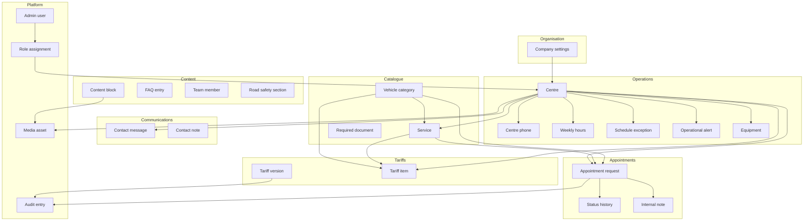

# 11 — Conceptual data model

| Delivery | Phase V · step **72** |
| --- | --- |
| Prerequisites | Gate 71 · [design/](../design/README.md) · [09-architecture.md](09-architecture.md) |
| Next | Step 74 — [11-erd.md](11-erd.md) indexes & constraints |
| Requirements | [04-requirements.md](04-requirements.md) · [06-rules.md](06-rules.md) · [10-admin.md](10-admin.md) |

Conceptual view of G3 Control V1 persistence: **what exists**, **why**, and **how domains relate**. No column types, indexes, or migration SQL — those belong to steps 73–74.

---

## 1. Purpose

The conceptual model answers:

1. Which **persistent things** the platform stores (vs computes, vs PHP lang files).
2. Which **business invariants** each thing protects ([06-rules.md](06-rules.md)).
3. How the nine architecture modules ([09-architecture.md](09-architecture.md)) map to storage boundaries before implementation (Phase VI steps 86–97).

**Three stores remain separate** (architecture § i18n):

| Store | Examples | Not in this model |
| --- | --- | --- |
| PHP lang files | Nav labels, button text, status **labels** | — |
| JSON-backed CMS fields | Centre address, service body, FAQ answer | Raw JSON editors |
| Language-neutral **codes** | `received`, `published`, `ecole-de-police` | Translated strings as keys |

---

## 2. Domain map

---

## 3. Bounded contexts

| Context | Aggregate roots | Primary consumers |
| --- | --- | --- |
| **Company** | Company settings | Public chrome, SEO defaults, agrément display |
| **Centre & schedule** | Centre, Schedule exception | Live status, appointment validation, centre pages |
| **Catalogue** | Vehicle category, Service | Services page, booking form, tariff matrix, documents |
| **Tariff** | Tariff version | Tarifs page, homepage finder, appointment handoff |
| **Appointment** | Appointment request | Rendez-vous form, admin queue, public tracking |
| **Contact** | Contact message | Contact form, admin inbox |
| **Content** | Content block, FAQ, Team member, Road safety section | Fixed public templates (steps 59–69) |
| **Media** | Media asset (library) | Centres, team, equipment, inspection, brand |
| **Identity & audit** | Admin user, Audit entry | Filament auth, compliance, investigations |

Contexts share one MySQL database (monolith). Cross-context rules are enforced in **application use cases**, not only foreign keys.

---

## 4. Entity catalogue

### 4.1 Company

| Entity | Description | Key rules |
| --- | --- | --- |
| **Company settings** | Singleton configuration: legal display name, slogans FR/EN, agrément number and year, company email, postal address, logo/favicon references, default SEO, social URLs | BR-COMP-001 agrément is company-wide · FR-CO-01–03 |

**Note:** Likely implemented via Spatie Laravel Settings (key-value or structured settings table), not a wide `companies` row duplicated per centre.

---

### 4.2 Centre & schedule

| Entity | Description | Key rules |
| --- | --- | --- |
| **Centre** | Inspection site: stable `code` slug (`ecole-de-police`, `nomayos`), bilingual name/address/landmark, GPS, email, postal, active flag, display order, per-page SEO, hero/gallery media links | FR-CE-01–02 · BR-CENT-004–005 · NFR-C-01 third centre later |
| **Centre phone** | Callable number: label, E.164 value, display order, optional WhatsApp flag | FR-CE-03 · Nomayos has two rows |
| **Weekly hours** | Seven rows (or embedded structure): weekday, open/closed, open time, close time | FR-CE-04 · BR-TIME-002 half-open interval |
| **Holiday policy** | Per centre: default behaviour on public holidays (V1: open) | FR-CE-05 · BR-CENT-003 |
| **Schedule exception** | Date-bounded override: applies to one centre or all; open/closed or custom hours; reason for admin | FR-CE-06 · BR-CENT-002 exceptions beat weekly hours |
| **Operational alert** | Optional public banner: severity, message FR/EN, optional centre scope, start, expiry | FR-CE-11 |
| **Equipment** | Named inspection asset (e.g. bench, tester): bilingual label, linked to one or both centres, optional media | FR-CN-06 |

**Computed, not stored:** “Open now”, next open, next close — derived by availability engine from weekly hours + holiday policy + exceptions in `Africa/Douala` (FR-CE-07–08, BR-TIME-001).

---

### 4.3 Catalogue

| Entity | Description | Key rules |
| --- | --- | --- |
| **Vehicle category** | Official category `code`, labels FR/EN, examples, description, display order, publish flag | FR-VC-01–02 · shared by finder, services, tariffs, booking |
| **Service** | G3-validated offering: bilingual title/summary/body, icon key, order, publish flag | FR-SV-01 · BR-SVC-001 only real services |
| **Service ↔ Centre** | Association: which centres perform which services | FR-SV-02 · BR-SVC-002 no booking unavailable combos |
| **Service ↔ Category** | Compatibility: which vehicle categories each service accepts | FR-SV-03 |
| **Required document** | Checklist item: bilingual label, attached to category and/or service | FR-SV-03 · Q-05 pending official list |

Unpublished categories/services are invisible publicly (FR-SV-04, FR-VC publish flag).

---

### 4.4 Tariff

| Entity | Description | Key rules |
| --- | --- | --- |
| **Tariff version** | Versioned price list header: label (e.g. `2026-01`), lifecycle code (`draft` → `reviewed` → `published` → `archived`), effective from/until, audit metadata | FR-TA-01–02 · BR-TARIFF-005 · BR-TARIFF-003 archive never destroy |
| **Tariff item** | One price line: vehicle category, integer XAF amount, optional service scope, linked centres, validity notes FR/EN | FR-TA-03 · BR-TARIFF-004 centre/service scoping · BR-TARIFF-002 |

**Invariant:** At most one **published** version is “currently effective” for public resolver (FR-TA-04–05). Empty state if none (FR-TA-09).

---

### 4.5 Appointment

| Entity | Description | Key rules |
| --- | --- | --- |
| **Appointment request** | Customer submission: public reference (`G3-YY-XXXXX`), centre, service, vehicle category, normalized registration plate, preferred date/period, contact name/phone/email, preferred channel, locale at submit, current status **code** | FR-AP-01–05 · BR-APPT-001–004 · FR-AP-12 idempotency |
| **Appointment status history** | Immutable append-only row per transition: status code, timestamp UTC, optional actor (system/admin user), customer-safe note if any | FR-AP-07 · BR-APPT-005 · NFR-R-01 transactional with create |
| **Appointment internal note** | Staff-only text, author, timestamp; **never** exposed on tracking | FR-AP-08 · BR-APPT-006 |

**Not stored:** numbered time slots, capacity calendar (scope out — NFR-C-02).

Status codes (machine): `received`, `under_review`, `confirmed`, `modification_requested`, `completed`, `cancelled` — transitions per BR-APPT-003.

---

### 4.6 Contact

| Entity | Description | Key rules |
| --- | --- | --- |
| **Contact message** | Inbound enquiry: intent code (appointment, centre, tariffs, assistance), name, phone, email, subject, optional centre, message body, status code (`new` → `in_progress` → `resolved`), locale | FR-CT-01–03 |
| **Contact internal note** | Staff note on a message thread | FR-CT-03 pattern mirrors appointments |

---

### 4.7 Content

Fixed templates ([BR-LANG-004](06-rules.md)); content is **blocks on pages**, not free-form routes.

| Entity | Description | Key rules |
| --- | --- | --- |
| **Content block** | Named slot on a fixed page template (e.g. `home.hero`, `about.mission`): JSON-backed FR/EN fields, publish flag, completeness tracked per locale | FR-CN-01 · FR-CN-07 · BR-LANG-001 |
| **FAQ entry** | Question/answer FR/EN, category code, order, publish | FR-CN-04 |
| **Team member** | Name, role FR/EN, bio FR/EN, photo media, `display_publicly`, order | FR-CN-05 |
| **Road safety section** | Ordered evergreen block: anchor code, title/body FR/EN, order (braking, tyres, lighting, …) | FR-CN-02–03 |

Page-level SEO (title, description, canonical) may live on **centre** rows, **company settings**, or dedicated SEO fields on block groups — detailed in step 73.

---

### 4.8 Media

| Entity | Description | Key rules |
| --- | --- | --- |
| **Media asset** | Central library item via Spatie Media Library: file, collection (`centres`, `equipment`, `team`, `inspection`, `road_safety`, `brand`), title, ALT FR/EN, publish flag, conversions (WebP/AVIF) | FR-MD-01–02 · NFR-P-03 |

Polymorphic attachment to centres, team, equipment, content blocks, company branding.

---

### 4.9 Identity & audit

| Entity | Description | Key rules |
| --- | --- | --- |
| **Admin user** | Filament login: name, email, password hash, MFA secrets, session metadata | FR-AD-01 · FR-AD-05 · NFR-S-01 |
| **Role assignment** | User ↔ role code (`super_admin`, `operations_admin`, `centre_manager`, `reception_officer`, `content_editor`); optional **centre scope** for manager/reception | FR-AD-02–03 · [10-admin.md](10-admin.md) combine assignments |
| **Audit entry** | Append-only log: actor, action, subject type/id, before/after snapshot or diff, IP, timestamp UTC | NFR-U-01 · tariff publish, schedule change, appointment transition, user admin |

Laravel `users` table exists from foundation; Spatie Permission for roles; Spatie Activity Log for audit (or unified audit table — step 73 decides).

---

## 5. Relationship summary

High-level cardinalities (logical detail in step 73):

| From | To | Relationship |
| --- | --- | --- |
| Company settings | — | Singleton (1) |
| Centre | Centre phone | 1 : 0..n |
| Centre | Weekly hours | 1 : 7 (weekdays) |
| Centre | Schedule exception | n : m via scope (centre-specific or `all`) |
| Centre | Service | n : m |
| Service | Vehicle category | n : m (compatibility) |
| Vehicle category | Required document | 1 : 0..n |
| Tariff version | Tariff item | 1 : 1..n |
| Tariff item | Centre | n : m |
| Tariff item | Vehicle category | n : 1 |
| Tariff item | Service | n : 0..1 (optional scope) |
| Appointment request | Centre, Service, Category | n : 1 each |
| Appointment request | Status history | 1 : 1..n |
| Appointment request | Internal note | 1 : 0..n |
| Contact message | Centre | n : 0..1 |
| Equipment | Centre | n : m |
| Admin user | Centre (scope) | n : 0..1 for scoped roles |
| Media asset | Various | polymorphic 0..1 : 0..n |

---

## 6. Aggregate roots & consistency

| Aggregate | Root | Consistency boundary |
| --- | --- | --- |
| Centre schedule | Centre + phones + weekly hours + holiday policy | Exception writes invalidate availability cache |
| Schedule exception | Schedule exception | May reference one or all centres atomically |
| Catalogue entry | Service or Vehicle category | Publish flags; centre links validated on save |
| Tariff version | Tariff version + items | Publish is one transaction: set published, archive prior, write audit |
| Appointment | Appointment request | Create + first history row atomic; transitions append history |
| Contact thread | Contact message | Status changes with optional notes |
| Content block | Content block | Publish blocked until FR and EN required fields complete |
| Media asset | Media asset | Derivatives generated on upload; unlink on delete policy TBD step 73 |

---

## 7. Lifecycle codes (stored values)

Domain compares **codes only** ([09-architecture.md](09-architecture.md)):

| Domain | Codes |
| --- | --- |
| Centre status | `active`, `inactive` |
| Tariff version | `draft`, `reviewed`, `published`, `archived` |
| Appointment | `received`, `under_review`, `confirmed`, `modification_requested`, `completed`, `cancelled` |
| Contact | `new`, `in_progress`, `resolved` |
| Live centre state (computed) | `open_normal_hours`, `closed` (+ exception variants in engine) |
| Alert severity | `info`, `warning`, `critical` (suggested) |
| Contact intent | `appointment`, `centre`, `tariffs`, `assistance` |

Labels render from `lang/fr/*.php` and `lang/en/*.php`.

---

## 8. What is intentionally not persisted

| Item | Where it lives |
| --- | --- |
| Navigation labels, button text | PHP lang files (FR-LO-04) |
| Status/tariff **labels** | PHP lang files |
| URL slugs per locale | `config/locale.php` + routes (Phase I frozen) |
| “Open now” boolean | Computed at read time |
| Current effective tariff resolution | Computed query over published versions |
| Tracking lookup attempts | Rate limiter / cache only — not a dossier ([05-quality.md](05-quality.md)) |
| Customer accounts | Out of V1 scope |
| Slot inventory / queue positions | Out of V1 scope |

---

## 9. Retention (conceptual)

Per [05-quality.md](05-quality.md) — operational policy mapped to tables in step 75:

| Data class | Suggested retention |
| --- | --- |
| Appointment request + history + notes | 24 months after final status |
| Contact message + notes | 12 months after resolved |
| Audit entries | 24 months |
| Tariff versions | Indefinite (archived, never destroyed — BR-TARIFF-003) |
| Media assets | Until unpublished/deleted by content editor |
| Admin users | Until deactivated |

---

## 10. Package alignment

| Concern | Laravel / package | Conceptual entities |
| --- | --- | --- |
| Settings | Spatie Laravel Settings | Company settings |
| Translations | Spatie Translatable or JSON columns | Centre, Service, Content block, FAQ, … |
| Media | Spatie Media Library | Media asset + polymorphic links |
| Roles | Spatie Permission | Admin user, Role assignment |
| Audit | Spatie Activity Log | Audit entry |
| Auth | Laravel + Filament | Admin user |

No repository-per-model ([NFR-M-05](05-quality.md)). Eloquent models map 1:1 to tables; use cases orchestrate transactions.

---

## 11. Migration groups (preview)

Conceptual entities roll into Phase VI migration batches ([PLAN.md](../PLAN.md)):

| Step | Migration group | Entities |
| ---: | --- | --- |
| 86 | Company / settings | Company settings |
| 87 | Centres | Centre, Centre phone, Weekly hours, Holiday policy |
| 88 | Schedule | Schedule exception, Operational alert |
| 89 | Catalogue | Vehicle category, Service, pivots, Required document |
| 90 | Tariffs | Tariff version, Tariff item, pivots |
| 91 | Appointments | Appointment request, Status history |
| 92 | Appointment notes | Internal note (separate table — FR-AP-08) |
| 93 | Content | Content block, FAQ, Team member, Road safety section, Equipment |
| 94 | Contact | Contact message, Contact internal note |
| 95 | Platform | Media collections config, role seeds, audit config |

Seed step 96: two centres + locked baseline hours only — no invented prices or services ([01-baseline.md](01-baseline.md), Q-01/Q-02).

---

## 12. Open items (do not invent in schema)

From [08-content.md](08-content.md) — schema must **allow** these without hard-coding V1 fiction:

| ID | Impact on model |
| --- | --- |
| Q-01 | Tariff items empty until official matrix supplied |
| Q-02 | Service ↔ centre links empty until G3 confirms |
| Q-05 | Required document rows empty until supplied |
| Q-06 | Category codes seeded when official list arrives |
| Q-08 | Company legal name field nullable until counsel |

---

## 13. Acceptance (step 72)

- [x] All nine architecture modules have identified persistent entities
- [x] Business rules mapped to entity invariants
- [x] Appointment history vs internal notes separated conceptually
- [x] Tariff versioning and lifecycle distinct from catalogue
- [x] Three i18n stores respected (codes vs JSON CMS vs PHP lang)
- [x] V1 exclusions documented (no slots, no customer accounts)
- [x] Migration group preview aligns with PLAN steps 86–95

**Next:** Step **73** — Logical ERD with tables, columns, keys → [11-erd.md](11-erd.md).
