# 11 — Logical ERD

| Delivery | Phase V · step **73** |
| --- | --- |
| Prerequisites | [11-conceptual-model.md](11-conceptual-model.md) · Gate 71 |
| Next | Step 74 — [11-indexes-constraints.md](11-indexes-constraints.md) · Step 75 — [11-retention.md](11-retention.md) |
| Implementation | Phase VI migrations steps 86–95 |

Logical entity–relationship design for G3 Control V1: **tables, columns, primary keys, foreign keys, and cardinalities**. Index tuning and constraint commentary are expanded in step 74; retention mapping in step 75.

---

## 1. Conventions

| Convention | Rule |
| --- | --- |
| Primary keys | `bigint unsigned` auto-increment `id`, except where noted |
| Timestamps | `created_at`, `updated_at` UTC ([BR-TIME-003](06-rules.md)); history tables append-only |
| Codes | `varchar(64)` snake_case; compared in PHP, labelled via `lang/` |
| Money | `amount_xaf` `unsigned int` — integer XAF ([BR-TARIFF-002](06-rules.md)) |
| Phones | `*_e164` `varchar(20)` storage; national display in presenters |
| GPS | `decimal(10,7)` latitude / longitude |
| Bilingual CMS | JSON object `{"fr":"…","en":"…"}` on column; Filament tabs, never raw JSON in UI ([FR-LO-05](04-requirements.md)) |
| Soft delete | Not used on tariff versions (archive instead — [BR-TARIFF-003](06-rules.md)) |
| Polymorphic media | Spatie Media Library `media` table |

**Existing foundation tables** (Phase III): `users`, `password_reset_tokens`, `sessions`, `cache`, `cache_locks`, `jobs`, `job_batches`, `failed_jobs` — unchanged unless noted.

---

## 2. Overview diagram

```mermaid
erDiagram
    users ||--o{ appointment_status_histories : "actor"
    users ||--o{ appointment_internal_notes : "author"
    users ||--o{ contact_internal_notes : "author"
    users ||--o{ admin_user_scopes : "scoped"
    users ||--o{ schedule_exceptions : "created"

    centres ||--|{ centre_phones : "has"
    centres ||--|{ centre_weekly_hours : "has"
    centres ||--o{ schedule_exceptions : "scoped"
    centres ||--o{ operational_alerts : "scoped"
    centres ||--o{ centre_equipment : "has"
    centres ||--o{ centre_service : "offers"
    centres ||--o{ tariff_item_centre : "priced_at"
    centres ||--o{ appointment_requests : "receives"
    centres ||--o{ contact_messages : "optional"
    centres ||--o{ admin_user_scopes : "scope"

    vehicle_categories ||--o{ service_vehicle_category : "compatible"
    vehicle_categories ||--o{ tariff_items : "priced"
    vehicle_categories ||--o{ appointment_requests : "for"
    vehicle_categories ||--o{ required_documents : "needs"

    services ||--o{ centre_service : "at"
    services ||--o{ service_vehicle_category : "accepts"
    services ||--o{ tariff_items : "optional_scope"
    services ||--o{ appointment_requests : "for"
    services ||--o{ required_documents : "needs"

    tariff_versions ||--|{ tariff_items : "contains"
    tariff_items ||--o{ tariff_item_centre : "at"

    appointment_requests ||--|{ appointment_status_histories : "timeline"
    appointment_requests ||--o{ appointment_internal_notes : "staff"

    contact_messages ||--o{ contact_internal_notes : "staff"

    equipment ||--o{ centre_equipment : "at"

    users {
        bigint id PK
        string name
        string email UK
        string password
    }

    centres {
        bigint id PK
        string code UK
        json name
        string status
    }

    appointment_requests {
        bigint id PK
        string public_reference UK
        string status
    }

    tariff_versions {
        bigint id PK
        string label UK
        string status
    }
```



---

## 3. Table catalogue

### 3.1 Summary

| # | Table | Domain | Migration step |
| ---: | --- | --- | ---: |
| 1 | `settings` | Company | 86 |
| 2 | `centres` | Centre | 87 |
| 3 | `centre_phones` | Centre | 87 |
| 4 | `centre_weekly_hours` | Centre | 87 |
| 5 | `schedule_exceptions` | Schedule | 88 |
| 6 | `operational_alerts` | Schedule | 88 |
| 7 | `vehicle_categories` | Catalogue | 89 |
| 8 | `services` | Catalogue | 89 |
| 9 | `centre_service` | Catalogue | 89 |
| 10 | `service_vehicle_category` | Catalogue | 89 |
| 11 | `required_documents` | Catalogue | 89 |
| 12 | `tariff_versions` | Tariff | 90 |
| 13 | `tariff_items` | Tariff | 90 |
| 14 | `tariff_item_centre` | Tariff | 90 |
| 15 | `appointment_requests` | Appointment | 91 |
| 16 | `appointment_status_histories` | Appointment | 91 |
| 17 | `appointment_internal_notes` | Appointment | 92 |
| 18 | `content_blocks` | Content | 93 |
| 19 | `faq_entries` | Content | 93 |
| 20 | `team_members` | Content | 93 |
| 21 | `road_safety_sections` | Content | 93 |
| 22 | `equipment` | Content | 93 |
| 23 | `centre_equipment` | Content | 93 |
| 24 | `page_seo` | Content / SEO | 93 |
| 25 | `contact_messages` | Contact | 94 |
| 26 | `contact_internal_notes` | Contact | 94 |
| 27 | `admin_user_scopes` | Identity | 95 |
| 28 | `media` | Media | 95 (Spatie) |
| 29 | `activity_log` | Audit | 95 (Spatie) |
| 30+ | Spatie Permission tables | Identity | 95 |

---

## 4. Company settings

Implemented with **Spatie Laravel Settings** — typed settings classes, persisted in `settings`.

### `settings`

| Column | Type | Null | Description |
| --- | --- | --- | --- |
| `id` | bigint | NO | PK |
| `group` | varchar(255) | NO | Settings group class name |
| `name` | varchar(255) | NO | Property name within group |
| `locked` | boolean | NO | Default false |
| `payload` | json | NO | Serialized value |

**Unique:** (`group`, `name`)

### `CompanySettings` properties (logical, not columns)

| Property | Type | Rules |
| --- | --- | --- |
| `legal_name` | string nullable | Q-08 — nullable until counsel |
| `display_name` | string | Default `G3 Control` |
| `slogan` | json `{fr,en}` | [01-baseline.md](01-baseline.md) |
| `agrement_number` | string | `0291` — company-wide [BR-COMP-001](06-rules.md) |
| `agrement_year` | smallint | `2020` |
| `email` | string | Company contact |
| `postal_address` | string | BP line |
| `default_seo_title` | json `{fr,en}` | Fallback meta |
| `default_seo_description` | json `{fr,en}` | Fallback meta |
| `social_links` | json | `{facebook, linkedin, …}` optional |

Logo and favicon attach via Spatie Media on a settings media holder model (implementation detail step 86).

---

## 5. Centres & schedule

### `centres`

| Column | Type | Null | Description |
| --- | --- | --- | --- |
| `id` | bigint | NO | PK |
| `code` | varchar(64) | NO | Stable slug: `ecole-de-police`, `nomayos` — UK |
| `name` | json | NO | `{fr,en}` |
| `address` | json | NO | Street / area |
| `landmark` | json | NO | Descent / carrefour line |
| `latitude` | decimal(10,7) | NO | |
| `longitude` | decimal(10,7) | NO | |
| `email` | varchar(255) | NO | Centre display email |
| `postal_code` | varchar(32) | YES | Shared BP allowed |
| `status` | varchar(32) | NO | `active` \| `inactive` [BR-CENT-005](06-rules.md) |
| `sort_order` | unsigned smallint | NO | Hub display order |
| `holiday_default_open` | boolean | NO | V1 default `true` [FR-CE-05](04-requirements.md) |
| `seo_title` | json | YES | Override per centre page |
| `seo_description` | json | YES | |
| `created_at` | timestamp | NO | |
| `updated_at` | timestamp | NO | |

**Media:** hero image, gallery — Spatie collections `hero`, `gallery` on `Centre` model.

### `centre_phones`

| Column | Type | Null | Description |
| --- | --- | --- | --- |
| `id` | bigint | NO | PK |
| `centre_id` | bigint | NO | FK → `centres.id` |
| `label` | varchar(64) | NO | e.g. `primary`, `secondary` |
| `e164` | varchar(20) | NO | [BR-CENT-004](06-rules.md) |
| `is_whatsapp` | boolean | NO | Default false · FR-CE-S1 |
| `sort_order` | unsigned tinyint | NO | |
| `created_at` | timestamp | NO | |
| `updated_at` | timestamp | NO | |

### `centre_weekly_hours`

| Column | Type | Null | Description |
| --- | --- | --- | --- |
| `id` | bigint | NO | PK |
| `centre_id` | bigint | NO | FK → `centres.id` |
| `weekday` | tinyint | NO | `1`=Mon … `7`=Sun (ISO) |
| `is_open` | boolean | NO | |
| `opens_at` | time | YES | Required if open |
| `closes_at` | time | YES | Half-open: closed **at** close [BR-TIME-002](06-rules.md) |
| `created_at` | timestamp | NO | |
| `updated_at` | timestamp | NO | |

**Unique:** (`centre_id`, `weekday`) — exactly 7 rows per centre at seed.

### `schedule_exceptions`

| Column | Type | Null | Description |
| --- | --- | --- | --- |
| `id` | bigint | NO | PK |
| `applies_to_all_centres` | boolean | NO | `true` = global override |
| `centre_id` | bigint | YES | FK → `centres.id`; NULL when all centres |
| `starts_on` | date | NO | Inclusive, Africa/Douala calendar date |
| `ends_on` | date | YES | Inclusive; NULL = single day |
| `is_open` | boolean | NO | Closed override vs custom open |
| `opens_at` | time | YES | Custom hours if open |
| `closes_at` | time | YES | |
| `reason` | json | YES | Admin-only `{fr,en}` |
| `created_by` | bigint | YES | FK → `users.id` |
| `created_at` | timestamp | NO | |
| `updated_at` | timestamp | NO | |

**Check (step 74):** if `applies_to_all_centres` then `centre_id` IS NULL; else `centre_id` NOT NULL.

### `operational_alerts`

| Column | Type | Null | Description |
| --- | --- | --- | --- |
| `id` | bigint | NO | PK |
| `severity` | varchar(32) | NO | `info` \| `warning` \| `critical` |
| `message` | json | NO | `{fr,en}` public banner text |
| `centre_id` | bigint | YES | FK → `centres.id`; NULL = site-wide |
| `starts_at` | datetime | NO | |
| `expires_at` | datetime | YES | NULL = until manually cleared |
| `is_active` | boolean | NO | Admin toggle |
| `created_at` | timestamp | NO | |
| `updated_at` | timestamp | NO | |

---

## 6. Catalogue

### `vehicle_categories`

| Column | Type | Null | Description |
| --- | --- | --- | --- |
| `id` | bigint | NO | PK |
| `code` | varchar(64) | NO | Official category code — UK · Q-06 |
| `label` | json | NO | `{fr,en}` |
| `examples` | json | YES | `{fr,en}` e.g. vehicle types |
| `description` | json | YES | |
| `sort_order` | unsigned smallint | NO | Finder / matrix order |
| `is_published` | boolean | NO | FR-VC-01 |
| `created_at` | timestamp | NO | |
| `updated_at` | timestamp | NO | |

### `services`

| Column | Type | Null | Description |
| --- | --- | --- | --- |
| `id` | bigint | NO | PK |
| `code` | varchar(64) | NO | Stable internal code — UK |
| `title` | json | NO | `{fr,en}` |
| `summary` | json | YES | |
| `body` | json | YES | Long description |
| `icon` | varchar(64) | YES | Lucide icon key |
| `sort_order` | unsigned smallint | NO | |
| `is_published` | boolean | NO | FR-SV-04 |
| `created_at` | timestamp | NO | |
| `updated_at` | timestamp | NO | |

### `centre_service`

| Column | Type | Null | Description |
| --- | --- | --- | --- |
| `centre_id` | bigint | NO | FK → `centres.id` |
| `service_id` | bigint | NO | FK → `services.id` |

**Primary key:** (`centre_id`, `service_id`)

### `service_vehicle_category`

| Column | Type | Null | Description |
| --- | --- | --- | --- |
| `service_id` | bigint | NO | FK → `services.id` |
| `vehicle_category_id` | bigint | NO | FK → `vehicle_categories.id` |

**Primary key:** (`service_id`, `vehicle_category_id`)

### `required_documents`

| Column | Type | Null | Description |
| --- | --- | --- | --- |
| `id` | bigint | NO | PK |
| `label` | json | NO | `{fr,en}` checklist label |
| `vehicle_category_id` | bigint | YES | FK → `vehicle_categories.id` |
| `service_id` | bigint | YES | FK → `services.id` |
| `sort_order` | unsigned smallint | NO | |
| `created_at` | timestamp | NO | |
| `updated_at` | timestamp | NO | |

**Check (step 74):** at least one of `vehicle_category_id`, `service_id` NOT NULL.

---

## 7. Tariffs

### `tariff_versions`

| Column | Type | Null | Description |
| --- | --- | --- | --- |
| `id` | bigint | NO | PK |
| `label` | varchar(64) | NO | e.g. `2026-01` — UK |
| `status` | varchar(32) | NO | `draft` \| `reviewed` \| `published` \| `archived` |
| `effective_from` | date | NO | |
| `effective_until` | date | YES | NULL = open-ended |
| `reviewed_at` | timestamp | YES | |
| `reviewed_by` | bigint | YES | FK → `users.id` |
| `published_at` | timestamp | YES | |
| `published_by` | bigint | YES | FK → `users.id` |
| `created_at` | timestamp | NO | |
| `updated_at` | timestamp | NO | |

**Business rule (app layer + step 74):** at most one `published` version effective on a given date ([FR-TA-04](04-requirements.md)).

### `tariff_items`

| Column | Type | Null | Description |
| --- | --- | --- | --- |
| `id` | bigint | NO | PK |
| `tariff_version_id` | bigint | NO | FK → `tariff_versions.id` |
| `vehicle_category_id` | bigint | NO | FK → `vehicle_categories.id` |
| `service_id` | bigint | YES | FK → `services.id` — optional narrow scope |
| `amount_xaf` | unsigned int | NO | Integer FCFA |
| `validity_notes` | json | YES | `{fr,en}` footnotes |
| `sort_order` | unsigned smallint | NO | Matrix row order |
| `created_at` | timestamp | NO | |
| `updated_at` | timestamp | NO | |

### `tariff_item_centre`

| Column | Type | Null | Description |
| --- | --- | --- | --- |
| `tariff_item_id` | bigint | NO | FK → `tariff_items.id` |
| `centre_id` | bigint | NO | FK → `centres.id` |

**Primary key:** (`tariff_item_id`, `centre_id`) — [BR-TARIFF-004](06-rules.md)

---

## 8. Appointments

### `appointment_requests`

| Column | Type | Null | Description |
| --- | --- | --- | --- |
| `id` | bigint | NO | PK — **never** public [BR-APPT-004](06-rules.md) |
| `public_reference` | varchar(16) | NO | e.g. `G3-26-A8FD2` — UK |
| `centre_id` | bigint | NO | FK → `centres.id` |
| `service_id` | bigint | NO | FK → `services.id` |
| `vehicle_category_id` | bigint | NO | FK → `vehicle_categories.id` |
| `registration_normalized` | varchar(32) | NO | Uppercase, no spaces — search [FR-AP-12](04-requirements.md) |
| `registration_display` | varchar(32) | YES | As entered |
| `preferred_date` | date | YES | Customer preference |
| `preferred_period` | varchar(32) | NO | `morning` \| `afternoon` \| `any` |
| `contact_name` | varchar(255) | NO | |
| `contact_phone_e164` | varchar(20) | NO | |
| `contact_email` | varchar(255) | YES | |
| `preferred_channel` | varchar(32) | YES | `phone` \| `email` \| `whatsapp` |
| `locale` | char(2) | NO | `fr` \| `en` at submit |
| `status` | varchar(32) | NO | Current code — denormalized for queue queries |
| `idempotency_key` | varchar(64) | YES | UK — double-submit guard [FR-AP-12](04-requirements.md) |
| `finalized_at` | timestamp | YES | Set on first `completed`/`cancelled` — retention [11-retention.md](11-retention.md) |
| `created_at` | timestamp | NO | |
| `updated_at` | timestamp | NO | |

**Status codes:** `received`, `under_review`, `confirmed`, `modification_requested`, `completed`, `cancelled`.

### `appointment_status_histories`

| Column | Type | Null | Description |
| --- | --- | --- | --- |
| `id` | bigint | NO | PK |
| `appointment_request_id` | bigint | NO | FK → `appointment_requests.id` |
| `status` | varchar(32) | NO | Code at transition |
| `public_note` | json | YES | Customer-safe `{fr,en}` optional |
| `actor_type` | varchar(32) | NO | `system` \| `user` |
| `actor_id` | bigint | YES | FK → `users.id` when `user` |
| `created_at` | timestamp | NO | Immutable — no `updated_at` |

Append-only. Public tracking reads this table only — never internal notes ([BR-APPT-006](06-rules.md)).

### `appointment_internal_notes`

| Column | Type | Null | Description |
| --- | --- | --- | --- |
| `id` | bigint | NO | PK |
| `appointment_request_id` | bigint | NO | FK → `appointment_requests.id` |
| `author_id` | bigint | NO | FK → `users.id` |
| `body` | text | NO | Staff-only |
| `created_at` | timestamp | NO | |
| `updated_at` | timestamp | NO | |

Separate table — migration step 92 ([FR-AP-08](04-requirements.md)).

---

## 9. Contact

### `contact_messages`

| Column | Type | Null | Description |
| --- | --- | --- | --- |
| `id` | bigint | NO | PK |
| `intent` | varchar(32) | NO | `appointment` \| `centre` \| `tariffs` \| `assistance` |
| `status` | varchar(32) | NO | `new` \| `in_progress` \| `resolved` |
| `name` | varchar(255) | NO | |
| `phone_e164` | varchar(20) | NO | |
| `email` | varchar(255) | NO | |
| `subject` | varchar(255) | NO | |
| `centre_id` | bigint | YES | FK → `centres.id` |
| `message` | text | NO | |
| `locale` | char(2) | NO | |
| `resolved_at` | timestamp | YES | Set on first `resolved` — retention [11-retention.md](11-retention.md) |
| `created_at` | timestamp | NO | |
| `updated_at` | timestamp | NO | |

### `contact_internal_notes`

| Column | Type | Null | Description |
| --- | --- | --- | --- |
| `id` | bigint | NO | PK |
| `contact_message_id` | bigint | NO | FK → `contact_messages.id` |
| `author_id` | bigint | NO | FK → `users.id` |
| `body` | text | NO | |
| `created_at` | timestamp | NO | |
| `updated_at` | timestamp | NO | |

---

## 10. Content & SEO

### `content_blocks`

Fixed template slots ([BR-LANG-004](06-rules.md)).

| Column | Type | Null | Description |
| --- | --- | --- | --- |
| `id` | bigint | NO | PK |
| `key` | varchar(128) | NO | e.g. `home.hero`, `about.mission` — UK |
| `page` | varchar(64) | NO | `home`, `about`, `technical_inspection`, … |
| `schema_version` | unsigned tinyint | NO | Block shape version |
| `content` | json | NO | `{fr:{…}, en:{…}}` field bag per block type |
| `locale_status` | json | NO | `{fr:complete, en:complete}` — publish gate [BR-LANG-001](06-rules.md) |
| `is_published` | boolean | NO | |
| `published_at` | timestamp | YES | |
| `created_at` | timestamp | NO | |
| `updated_at` | timestamp | NO | |

**Media:** block may reference library media IDs inside `content` JSON or via Spatie attach on holder.

### `faq_entries`

| Column | Type | Null | Description |
| --- | --- | --- | --- |
| `id` | bigint | NO | PK |
| `category_code` | varchar(64) | NO | Grouping code |
| `question` | json | NO | `{fr,en}` |
| `answer` | json | NO | `{fr,en}` |
| `sort_order` | unsigned smallint | NO | |
| `is_published` | boolean | NO | |
| `created_at` | timestamp | NO | |
| `updated_at` | timestamp | NO | |

### `team_members`

| Column | Type | Null | Description |
| --- | --- | --- | --- |
| `id` | bigint | NO | PK |
| `name` | varchar(255) | NO | Display name |
| `role_title` | json | NO | `{fr,en}` |
| `bio` | json | YES | `{fr,en}` |
| `display_publicly` | boolean | NO | FR-CN-05 |
| `sort_order` | unsigned smallint | NO | |
| `created_at` | timestamp | NO | |
| `updated_at` | timestamp | NO | |

**Media:** portrait via Spatie `photo` collection.

### `road_safety_sections`

| Column | Type | Null | Description |
| --- | --- | --- | --- |
| `id` | bigint | NO | PK |
| `anchor` | varchar(64) | NO | URL fragment code — UK e.g. `braking` |
| `title` | json | NO | `{fr,en}` |
| `body` | json | NO | `{fr,en}` |
| `sort_order` | unsigned smallint | NO | FR-CN-03 order |
| `is_published` | boolean | NO | |
| `created_at` | timestamp | NO | |
| `updated_at` | timestamp | NO | |

### `equipment`

| Column | Type | Null | Description |
| --- | --- | --- | --- |
| `id` | bigint | NO | PK |
| `code` | varchar(64) | NO | UK |
| `label` | json | NO | `{fr,en}` |
| `sort_order` | unsigned smallint | NO | |
| `created_at` | timestamp | NO | |
| `updated_at` | timestamp | NO | |

### `centre_equipment`

| Column | Type | Null | Description |
| --- | --- | --- | --- |
| `centre_id` | bigint | NO | FK → `centres.id` |
| `equipment_id` | bigint | NO | FK → `equipment.id` |

**Primary key:** (`centre_id`, `equipment_id`)

### `page_seo`

SEO for fixed public pages (not centre detail — those use `centres.seo_*`).

| Column | Type | Null | Description |
| --- | --- | --- | --- |
| `page` | varchar(64) | NO | PK — matches `config/locale.php` page keys |
| `seo_title` | json | NO | `{fr,en}` |
| `seo_description` | json | NO | `{fr,en}` |
| `updated_at` | timestamp | NO | |

---

## 11. Identity, media, audit

### `users` (extend existing)

| Column | Type | Null | Description |
| --- | --- | --- | --- |
| `id` | bigint | NO | PK (existing) |
| `name` | varchar(255) | NO | |
| `email` | varchar(255) | NO | UK |
| `password` | varchar(255) | NO | |
| `email_verified_at` | timestamp | YES | |
| `is_active` | boolean | NO | **New** — deactivate without delete |
| `mfa_secret` | text | YES | **New** — encrypted TOTP |
| `mfa_confirmed_at` | timestamp | YES | **New** |
| `remember_token` | varchar(100) | YES | |
| `created_at` | timestamp | NO | |
| `updated_at` | timestamp | NO | |

### `admin_user_scopes`

Centre scoping for `centre_manager` and `reception_officer` ([10-admin.md](10-admin.md)).

| Column | Type | Null | Description |
| --- | --- | --- | --- |
| `id` | bigint | NO | PK |
| `user_id` | bigint | NO | FK → `users.id` |
| `centre_id` | bigint | NO | FK → `centres.id` |
| `created_at` | timestamp | NO | |

**Unique:** (`user_id`, `centre_id`)

Roles assigned via **Spatie Permission** (`roles`, `permissions`, `model_has_roles`, `role_has_permissions`, `model_has_permissions`). Role names: `super_admin`, `operations_admin`, `centre_manager`, `reception_officer`, `content_editor`.

### Spatie `media`

Standard package schema — polymorphic `model_type` / `model_id`, `collection_name`, `file_name`, `disk`, `custom_properties` (stores `alt` `{fr,en}`, `title`, `is_published`).

Collections: `brand`, `centres`, `equipment`, `team`, `inspection`, `road_safety`.

### Spatie `activity_log`

| Column | Type | Description |
| --- | --- | --- |
| `log_name` | varchar | e.g. `default`, `tariff`, `appointment` |
| `description` | text | Action summary |
| `subject_type` / `subject_id` | morph | Entity changed |
| `causer_type` / `causer_id` | morph | Usually `User` |
| `properties` | json | Before/after |
| `created_at` | timestamp | UTC |

Covers NFR-U-01 audit subjects: appointments, tariffs, schedules, settings, users, services.

---

## 12. Foreign key graph

```text
centres
  ← centre_phones.centre_id
  ← centre_weekly_hours.centre_id
  ← schedule_exceptions.centre_id (nullable)
  ← operational_alerts.centre_id (nullable)
  ← centre_service.centre_id
  ← centre_equipment.centre_id
  ← tariff_item_centre.centre_id
  ← appointment_requests.centre_id
  ← contact_messages.centre_id (nullable)
  ← admin_user_scopes.centre_id

vehicle_categories
  ← service_vehicle_category.vehicle_category_id
  ← tariff_items.vehicle_category_id
  ← appointment_requests.vehicle_category_id
  ← required_documents.vehicle_category_id (nullable)

services
  ← centre_service.service_id
  ← service_vehicle_category.service_id
  ← tariff_items.service_id (nullable)
  ← appointment_requests.service_id
  ← required_documents.service_id (nullable)

tariff_versions
  ← tariff_items.tariff_version_id

tariff_items
  ← tariff_item_centre.tariff_item_id

appointment_requests
  ← appointment_status_histories.appointment_request_id
  ← appointment_internal_notes.appointment_request_id

contact_messages
  ← contact_internal_notes.contact_message_id

users
  ← appointment_status_histories.actor_id (nullable)
  ← appointment_internal_notes.author_id
  ← contact_internal_notes.author_id
  ← schedule_exceptions.created_by (nullable)
  ← tariff_versions.reviewed_by / published_by (nullable)
  ← admin_user_scopes.user_id
  ← activity_log.causer (polymorphic)
```

**On delete (step 74):** restrict on operational FKs; `cascade` on child rows (phones, hours, histories) where orphan rows are invalid.

---

## 13. Code columns reference

| Table | Column | Allowed values |
| --- | --- | --- |
| `centres` | `status` | `active`, `inactive` |
| `tariff_versions` | `status` | `draft`, `reviewed`, `published`, `archived` |
| `appointment_requests` | `status` | `received`, `under_review`, `confirmed`, `modification_requested`, `completed`, `cancelled` |
| `appointment_requests` | `preferred_period` | `morning`, `afternoon`, `any` |
| `appointment_requests` | `preferred_channel` | `phone`, `email`, `whatsapp` |
| `contact_messages` | `intent` | `appointment`, `centre`, `tariffs`, `assistance` |
| `contact_messages` | `status` | `new`, `in_progress`, `resolved` |
| `operational_alerts` | `severity` | `info`, `warning`, `critical` |
| `appointment_status_histories` | `actor_type` | `system`, `user` |

Implement as backed PHP enums in step 77 — see [12-domain-model.md](12-domain-model.md).

---

## 14. Seed expectations (step 96 preview)

| Table | V1 seed |
| --- | --- |
| `centres` | 2 rows — École de Police, Nomayos ([01-baseline.md](01-baseline.md)) |
| `centre_phones` | 3 rows — baseline phones |
| `centre_weekly_hours` | 14 rows — 7 × 2 centres |
| `vehicle_categories` | Empty until Q-06 |
| `services` | Empty until Q-02 |
| `tariff_versions` / `tariff_items` | Empty until Q-01 |
| `content_blocks` | Structure keys only; copy from [08-content.md](08-content.md) where ready |
| `roles` | 5 Spatie roles |
| `users` | Named admins only — no shared password ([02-charter.md](02-charter.md)) |

---

## 15. Migration mapping

| Step | Creates / alters |
| ---: | --- |
| 86 | `settings` + CompanySettings properties |
| 87 | `centres`, `centre_phones`, `centre_weekly_hours` |
| 88 | `schedule_exceptions`, `operational_alerts` |
| 89 | `vehicle_categories`, `services`, pivots, `required_documents` |
| 90 | `tariff_versions`, `tariff_items`, `tariff_item_centre` |
| 91 | `appointment_requests`, `appointment_status_histories` |
| 92 | `appointment_internal_notes` |
| 93 | `content_blocks`, `faq_entries`, `team_members`, `road_safety_sections`, `equipment`, `centre_equipment`, `page_seo` |
| 94 | `contact_messages`, `contact_internal_notes` |
| 95 | `users` extensions, `admin_user_scopes`, Spatie Permission + Media + Activity Log migrations |

---

## 16. Acceptance (step 73)

- [x] Every entity from [11-conceptual-model.md](11-conceptual-model.md) mapped to a table
- [x] Appointment history and internal notes on separate tables
- [x] Tariff versioning with item ↔ centre pivot
- [x] JSON bilingual columns identified; codes stored as varchar
- [x] Centre scoping table for admin roles
- [x] Package tables (Settings, Media, Permission, Activity Log) documented
- [x] FK graph and migration step alignment complete

**Next:** Steps **74–76** complete — see [11-indexes-constraints.md](11-indexes-constraints.md), [11-retention.md](11-retention.md), [11-gate-database-design.md](11-gate-database-design.md).
