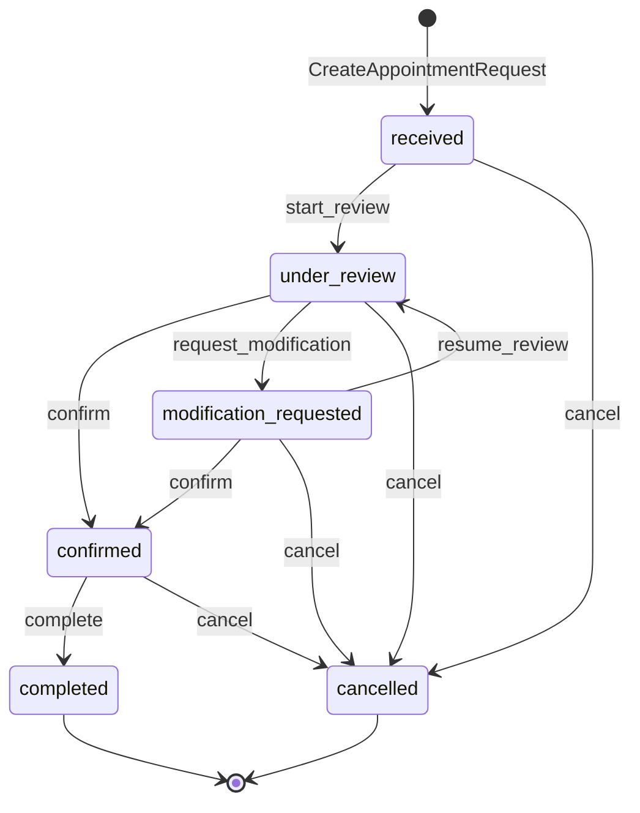

# 12 — Appointment state machine

| Delivery | Phase V · step **80** |
| --- | --- |
| Prerequisites | [12-domain-model.md](12-domain-model.md) · [06-rules.md](06-rules.md) |
| Implementation | `app/Domain/Appointment/AppointmentStateMachine.php` · step 102 |

Authoritative transition rules for appointment requests ([BR-APPT-003](06-rules.md)). Used by `TransitionAppointmentStatus`, Filament actions, and Pest — **one implementation**.

---

## 1. States

| Code | Label key | Final? | Public timeline? |
| --- | --- | :---: | :---: |
| `received` | `appointments.status.received` | no | yes |
| `under_review` | `appointments.status.under_review` | no | yes |
| `confirmed` | `appointments.status.confirmed` | no | yes |
| `modification_requested` | `appointments.status.modification_requested` | no | yes |
| `completed` | `appointments.status.completed` | **yes** | yes |
| `cancelled` | `appointments.status.cancelled` | **yes** | yes |

No `no_show` in V1 ([FR-AP-05](04-requirements.md)).

**Initial state:** `received` on create ([FR-AP-07](04-requirements.md)).

---

## 2. Transition table



| From | To | Admin action (FR) | Filament action |
| --- | --- | --- | --- |
| `received` | `under_review` | Prendre en charge | Start review |
| `received` | `cancelled` | Refuser | Cancel |
| `under_review` | `confirmed` | Confirmer | Confirm |
| `under_review` | `modification_requested` | Demander modification | Request modification |
| `under_review` | `cancelled` | Annuler | Cancel |
| `modification_requested` | `under_review` | Reprendre | Resume review |
| `modification_requested` | `confirmed` | Confirmer | Confirm |
| `modification_requested` | `cancelled` | Annuler | Cancel |
| `confirmed` | `completed` | Terminer | Complete |
| `confirmed` | `cancelled` | Annuler | Cancel |

**Illegal examples** (must throw `InvalidAppointmentTransitionException`):

| From | To | Why |
| --- | --- | --- |
| `received` | `completed` | Skips workflow [07-acceptance.md](07-acceptance.md) |
| `received` | `confirmed` | Must review first |
| `completed` | *any* | Final |
| `cancelled` | *any* | Final |

---

## 3. Side effects on transition

Every allowed transition via `TransitionAppointmentStatus`:

| Step | Action |
| --- | --- |
| 1 | `AppointmentStateMachine::assertCanTransition(from, to)` |
| 2 | Update `appointment_requests.status` |
| 3 | Insert `appointment_status_histories` row |
| 4 | Set `finalized_at` when entering `completed` or `cancelled` |
| 5 | Activity log + `AppointmentStatusChanged` event |

**Optional `public_note`:** bilingual JSON on history row — customer-safe only; shown on tracking timeline.

**Internal notes:** separate use case; never auto-created on transition.

---

## 4. Reschedule vs status

`UpdateAppointmentPreferredTime` may run without status change (staff adjusts date/period while `under_review`) OR combined with transition to `modification_requested` when customer must reconfirm.

| Current status | Reschedule allowed? |
| --- | --- |
| `received`, `under_review`, `modification_requested` | yes |
| `confirmed` | yes with audit note recommended |
| `completed`, `cancelled` | **no** |

---

## 5. Class design

```php
// app/Domain/Appointment/AppointmentStateMachine.php
final class AppointmentStateMachine
{
    /** @return list<AppointmentStatus> */
    public function allowedTransitions(AppointmentStatus $from): array;

    public function assertCanTransition(AppointmentStatus $from, AppointmentStatus $to): void;

    public function isFinal(AppointmentStatus $status): bool;
}
```

Transition map as private constant array — single source.

Filament: build action visibility from `allowedTransitions($record->status)`.

---

## 6. Public tracking mapping

Tracking shows **all status codes** on timeline ([FR-TR-04](04-requirements.md)) — labels from lang files.

Never expose:

- `appointment_internal_notes`
- `actor_id` / admin names
- Other customers’ data

---

## 7. Admin authorization by transition

Policy check in addition to state machine:

| Transition | Minimum role |
| --- | --- |
| → `cancelled` | Reception+ scoped |
| → `confirmed`, `completed` | Reception+ scoped |
| → `under_review` | Reception+ scoped |

Content Editor: **no** appointment transitions ([10-admin.md](10-admin.md)).

---

## 8. Test matrix (Pest · step 102)

| Test | Rule |
| --- | --- |
| `received` → `completed` throws | BR-APPT-003 / acceptance |
| Happy path to `completed` with 4 history rows | FR-AP-07 |
| `received` → `cancelled` allowed | acceptance |
| Final states have empty `allowedTransitions` | domain |
| Filament-visible actions match machine | FR-AD-03 |

---

## 9. Acceptance (step 80)

- [x] All six states and transitions documented
- [x] Illegal transitions listed
- [x] Side effects on each transition
- [x] Reschedule rules separate from status
- [x] Filament action mapping
- [x] Tracking vs internal separation

**Next:** Step **81** — Tariff engine.
